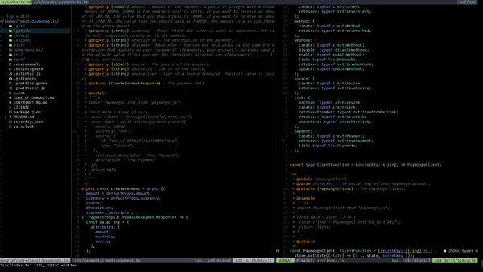
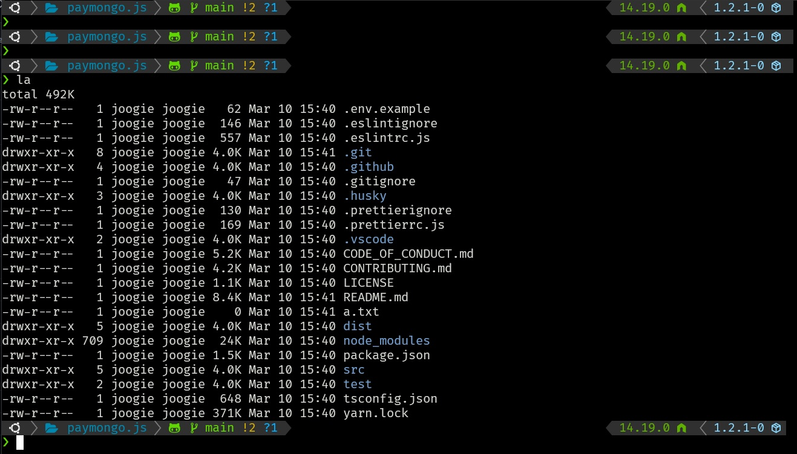

# dotfiles

my dotfiles config


## Installation

```bash
chmod +x install
./install
```

## Clean

```bash
chmod +x clean
./clean
```

### NVIM

#### Prerequisutes 

- [x] [vim-plug](https://github.com/junegunn/vim-plug)
- [x] [ripgrep](https://github.com/BurntSushi/ripgrep)
- [x] [fzf](https://github.com/junegunn/fzf)
- [x] [fd](https://github.com/sharkdp/fd)

> run `:checkhealth` to see remaining dependencies



### ZSH

#### Prerequisutes

- [x] [zsh-snap](https://github.com/marlonrichert/zsh-snap)
- [x] [powerlevel10k](https://github.com/romkatv/powerlevel10k)



