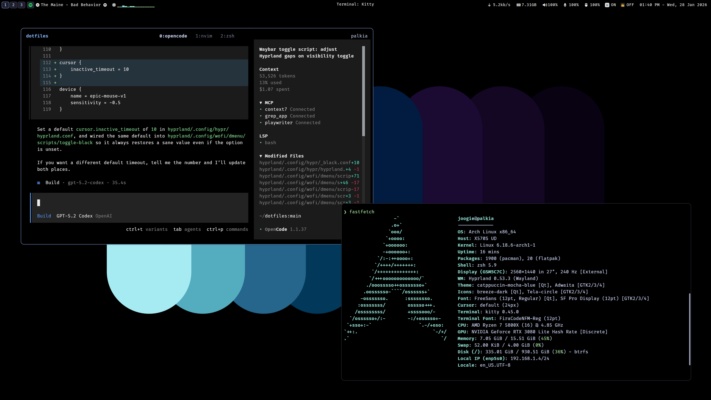
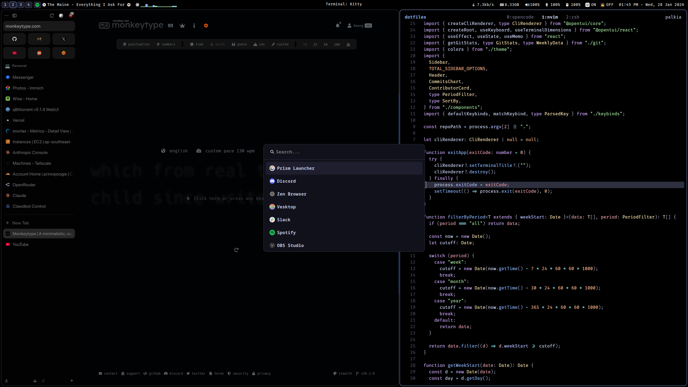
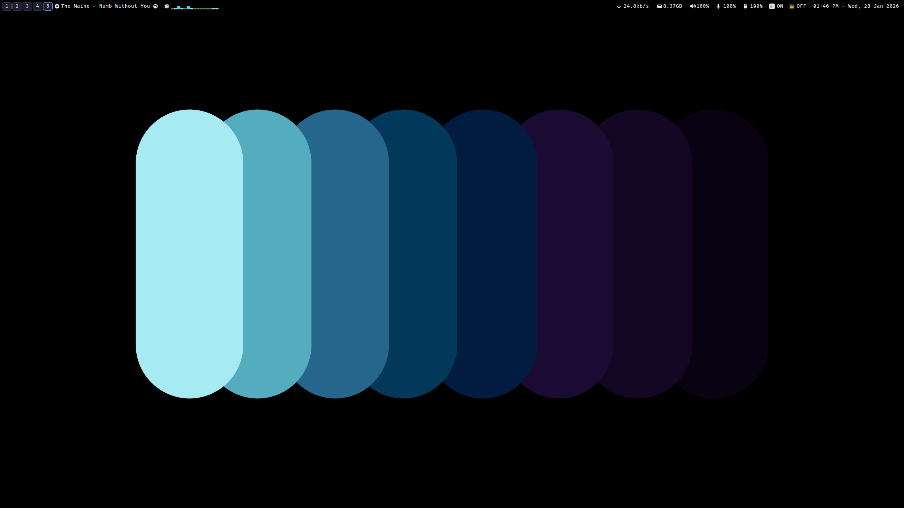

# dotfiles

Personal configuration for a productive and aesthetic development environment, focused on Linux (Hyprland) and macOS.





## ✨ Highlights

### 🖥️ Desktop (Linux)

- **Window Manager**: [Hyprland](https://hyprland.org/) - A dynamic tiling Wayland compositor.
- **Status Bar**: [Waybar](https://github.com/Alexays/Waybar) with custom modules for Spotify, Tailscale, and Tunnelbear.
- **Widgets**: [Eww](https://github.com/elkowar/eww) for interactive desktop elements like calendars.
- **Launcher**: [Wofi](https://hg.sr.ht/~scoopta/wofi) with a collection of custom utility scripts.
- **Notifications**: [Dunst](https://dunst-project.org/) for lightweight system alerts.

### ⌨️ Editor

- **Neovim**: A modern Lua-based configuration using [lazy.nvim](https://github.com/folke/lazy.nvim).
  - Built-in LSP, Treesitter, and snacks.nvim integration.
  - Optimized for performance and a seamless coding experience.
  - Custom UI components and statuslines.

### 🛠️ Shell & Tools

- **Terminal**: [Kitty](https://sw.kovidgoyal.net/kitty/) and [Alacritty](https://alacritty.org/) support.
- **Shell**: Zsh with [Starship](https://starship.rs/) prompt.
- **File Manager**: [yazi](https://github.com/sxyazi/yazi) - Blazing fast terminal file manager.
- **Multiplexer**: [Tmux](https://github.com/tmux/tmux) for robust session management.
- **Productivity**: Raycast scripts for macOS automation.

## 📂 Structure

| Folder        | Description                                         |
| :------------ | :-------------------------------------------------- |
| `hyprland/`   | Hyprland, Waybar, Wofi, and Eww configurations      |
| `nvim/`       | Neovim configuration (Lua)                          |
| `shell/`      | Shell environment (Zsh, Starship, Tmux, Git)        |
| `sddm/`       | macOS-inspired login theme                          |
| `wallpapers/` | A collection of curated high-resolution backgrounds |

## 🚀 Setup

### 1. Clone the repository

```bash
git clone https://github.com/princejoogie/dotfiles.git ~/dotfiles
cd ~/dotfiles
```

### 2. Install GNU Stow

Ensure `stow` is installed on your system:

- **Arch Linux**: `sudo pacman -S stow`
- **macOS**: `brew install stow`

### 3. Symlink configurations

Use `stow` to link the configurations to your home directory:

```bash
# Link core configurations
stow hyprland
stow nvim
stow shell
```

> [!NOTE]
> For SDDM theme installation, refer to the scripts within the `sddm/` directory.

## 🖱️ Scyrox Mouse Battery (Waybar)

This Waybar module reads the Scyrox mouse battery via HID and displays it with a custom icon.

### 1. Install dependencies

- `bun` (runtime for the script)
- `node-hid` (HID access)

```bash
bun add -g node-hid
```

### 2. Allow user access to the HID device

```bash
sudo cp ~/dotfiles/system/udev/99-scyrox-hidraw.rules /etc/udev/rules.d/
sudo udevadm control --reload-rules && sudo udevadm trigger
sudo usermod -aG input $USER
```

Log out and back in (or reboot) so the group change takes effect.

### 3. Verify

```bash
scyrox-battery --device=scyrox --json --no-sudo
```

If that returns JSON, restart Waybar and the module will appear between the mic input and Tailscale.
